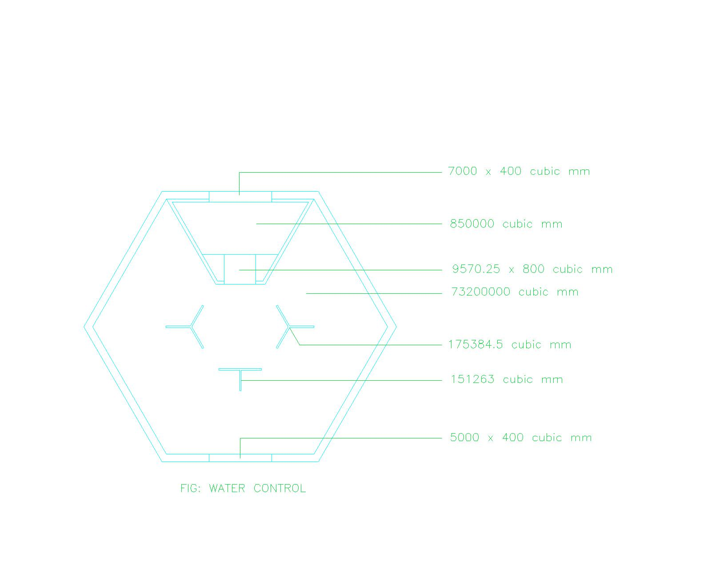

# Water Section

---

The water section of the Hexcell project focuses on the design and implementation of water flows and water contains within the hexagonal cells. The water system is designed to be efficient, sustainable, and visually appealing, enhancing the overall aesthetic of the project while providing functional benefits.

---

## Water plan and areas

### core:

The core area of the water system is designed to be the central hub for water management. It can contain maximum **_73.2 liters_** of water, which is distributed to the surrounding areas.

### water bowl:

The water bowl is a alternative storage of water. It can contain upto **_0.85 liters_** of water. This part is connect with the core area through a [wide channel](#wide_channel), allowing for easy transfer of water between the two **HexCells**.

### Wide channel:

This channel connects the core area to the water bowl, can transmit upto **_7.6562 liters_** of water at a time. The channel is designed to be wide enough to accommodate the flow of water without causing any blockages or slowdowns.

### Normal channel:

These channels are designed to connect the one **HexCell** to another. They can transmit upto **_2.4 liters_** of water at a time. The normal channels are narrower than the wide channel, allowing for a more controlled flow of water between the cells.

There are two normal channels in of one **HexCell**. The first channel connects the core area to another **HexCell** [water bowl](#water_bowl), while the second channel connects the [water bowl](#water_bowl) to the core area of another **HexCell**. This design allows for efficient water transfer between the cells, ensuring that each cell has access to the water it needs.
